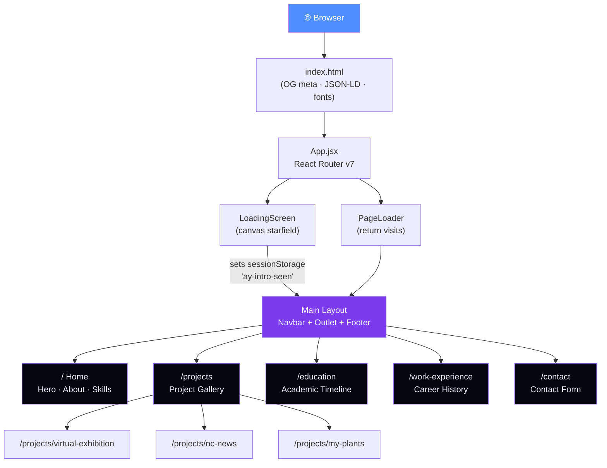

<div align="center">


[](https://git.io/typing-svg)

<br/>

[](https://ahmadyousufi.dev/)
[](https://www.linkedin.com/in/ahmad-ozair-yousufi/)
[](https://github.com/AOYousufi)
[](mailto:ozairyousufi1400@gmail.com)


</div>

---

## 📖 Table of Contents

<details open>
<summary>Click to expand</summary>

- [✨ What This Is](#-what-this-is)
- [🎬 Tech Stack](#-tech-stack)
- [🗺️ Architecture](#%EF%B8%8F-architecture)
- [🚀 Featured Projects](#-featured-projects)
- [⚡ Animation System](#-animation-system)
- [🎨 Design System](#-design-system)
- [🛠️ Local Development](#%EF%B8%8F-local-development)
- [📁 Project Structure](#-project-structure)
- [🧑‍💼 About Me](#-about-me)
- [📊 GitHub Stats](#-github-stats)

</details>

---

## ✨ What This Is

> Not just a portfolio. A statement.

This is a **hand-crafted, zero-compromise personal portfolio** — every pixel intentional, every animation purposeful. Built entirely without UI kits, it demonstrates what's possible when you go deep on fundamentals instead of leaning on scaffolding.

| What it does | How |
|---|---|
| Feels cinematic on load | `canvas` starfield → GSAP timeline → page reveal |
| Transitions like a native app | React Router v7 + GSAP page transitions |
| Respects every user | `prefers-reduced-motion` gates every single animation |
| Loads instantly | Vite code-splitting, zero blocking resources |
| Works for everyone | Keyboard-navigable, ARIA-labelled, focus-visible throughout |

---

## 🎬 Tech Stack

<div align="center">

| Layer | Technology | Why |
|:---:|:---:|:---|
| ⚛️ **UI** | React 19 | Latest concurrent features, stable API |
| ⚡ **Build** | Vite 6 | Sub-second HMR, optimised production bundles |
| 🧭 **Routing** | React Router v7 | File-based routing, data loaders |
| 🎞️ **Animation** | GSAP 3 + ScrollTrigger | Industry-standard, silky 60fps |
| 🎨 **Styling** | Custom CSS (scoped) | Zero runtime cost, full control |
| 🔍 **Quality** | ESLint v9 flat config | Zero-warning policy enforced |

</div>

<div align="center">
<br/>


</div>

---

## 🗺️ Architecture



<details>
<summary><strong>🔄 Loading Flow — how the first impression works</strong></summary>

```
First visit                          Return visit
────────────────                     ──────────────
Canvas starfield renders             PageLoader renders
   ↓                                    ↓
GSAP reveal timeline fires           Lighter transition plays
   ↓                                    ↓
sessionStorage flag set              Flag already present → skip intro
   ↓                                    ↓
Route renders normally               Route renders normally
```

Every GSAP animation is initialised **once** via `src/utils/gsap.js` and imported — never re-initialised per component.

</details>

---

## 🎨 Design System

The entire visual language lives in `src/index.css` as CSS custom properties. **Zero hardcoded values in components** — ever.

<details>
<summary><strong>📐 Full token reference</strong></summary>

```css
/* ─── Backgrounds ─────────────────────────────── */
--bg-base:        #050510   /* Page — outermost layer          */
--bg-surface:     #0a0a1a   /* Cards, panels                   */
--bg-elevated:    #0f0f22   /* Modals, tooltips                */

/* ─── Accents ─────────────────────────────────── */
--accent-blue:    #4f8eff   /* Primary CTA, links, focus rings */
--accent-violet:  #7c3aed   /* Secondary, gradients            */
--accent-cyan:    #00d4ff   /* Highlights, hover, glows        */

/* ─── Text ────────────────────────────────────── */
--text-primary:   #f0f0ff   /* Headings, key content           */
--text-secondary: #8888aa   /* Body copy, descriptions         */
--text-muted:     #44445a   /* Timestamps, metadata            */

/* ─── Borders ─────────────────────────────────── */
--border-subtle:  rgba(255,255,255,0.06)
--border-visible: rgba(255,255,255,0.12)

/* ─── Glows ────────────────────────────────────── */
--glow-blue:      0 0 40px rgba(79,142,255,0.15)
--glow-violet:    0 0 40px rgba(124,58,237,0.15)
--glow-cyan:      0 0 30px rgba(0,212,255,0.12)
```

**Spacing:** 8pt grid — `4 · 8 · 16 · 24 · 32 · 48 · 64 · 96 · 128px`

**Fonts:**
- Headings → `Syne` 700/800, tracking `-0.03em`
- Body → `Plus Jakarta Sans` 400/500/600
- Code → `JetBrains Mono`

</details>

---

## 🛠️ Local Development

```bash
# 1. Clone
git clone https://github.com/AOYousufi/My-Portfolio.git
cd My-Portfolio

# 2. Install
npm install

# 3. Dev server (Vite HMR — not npm start)
npm run dev

# 4. Lint (zero-warning policy)
npm run lint

# 5. Production build (run before every commit)
npm run build

# 6. Preview production build locally
npm run preview
```

> [!IMPORTANT]
> The dev command is `npm run dev` — **not** `npm start`. There is no `npm start` in this project.

> [!TIP]
> Run `npm run build` before committing. The CI check will fail if the build breaks.

---

## 📁 Project Structure

```
My-Portfolio/
├── public/
│   ├── robots.txt           ← SEO
│   ├── sitemap.xml          ← SEO
│   └── og-image.png         ← Social share preview
├── src/
│   ├── index.css            ← ⭐ DESIGN SYSTEM — read this first
│   ├── App.jsx              ← Router + top-level layout
│   ├── utils/
│   │   └── gsap.js          ← GSAP initialised once here only
│   ├── hooks/
│   │   ├── useTypewriter.js ← Hero phrase cycling
│   │   └── useReducedMotion.js ← a11y animation gate
│   ├── components/
│   │   ├── Navbar.jsx
│   │   └── Footer.jsx
│   └── pages/
│       ├── Home.jsx         ← Hero · About · Skills
│       ├── Projects.jsx     ← Gallery
│       ├── Education.jsx
│       ├── WorkExperience.jsx
│       ├── Contact.jsx
│       └── ProjectDetail/
│           ├── VirtualExhibition.jsx
│           ├── NCNews.jsx
│           └── MyPlants.jsx
├── index.html               ← OG meta · JSON-LD · font preloads
├── vite.config.js
└── package.json
```

---

## 🧑‍💼 About Me


**Ahmad Ozair Yousufi** — Junior Developer building full-stack web experiences with an obsessive eye for detail.

- 🎓 **BSc Software Development** — Staffordshire University
- 🏕️ **Full-Stack Bootcamp** — Northcoders (Node.js, React, TDD, REST APIs)
- 📍 **Based in** Stone, Staffordshire, UK
- 💬 **Ask me about** GSAP, React architecture, CSS custom properties
- 📬 **Email** [ozairyousufi1400@gmail.com](mailto:ozairyousufi1400@gmail.com)
- 🌐 **Portfolio** [ahmadyousufi.dev](https://ahmadyousufi.dev/)

<br clear="right"/>

---

## 📊 GitHub Stats

<div align="center">


&nbsp;&nbsp;


</div>

---

## ⭐ If This Helped You

<div align="center">

If you're using this as inspiration for your own portfolio — that's exactly what it's here for.

[](https://github.com/AOYousufi/My-Portfolio)
[](https://github.com/AOYousufi/My-Portfolio/fork)
[](https://www.linkedin.com/in/ahmad-ozair-yousufi/)

<br/>

> *"The details are not the details. They make the design."*
> — Charles Eames

</div>


